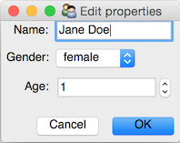

============================================
TraitsUI: Traits-capable windowing framework
============================================

The TraitsUI project contains a toolkit-independent GUI abstraction layer,
which is used to support the "visualization" features of the
`Traits <http://github.com/enthought/traits>`_ package.
Thus, you can write model in terms of the Traits API and specify a GUI
in terms of the primitives supplied by TraitsUI (views, items, editors,
etc.), and let TraitsUI and your selected toolkit and back-end take care of
the details of displaying them.

The following GUI backends are supported:

- wxPython
- PyQt
- PySide

Warning
~~~~~~~

In TraitsUI version 5.0 the default GUI backend will change from ``wx`` to
``qt4``.

Example
-------

Given a Traits model like the following::

    from traits.api import HasTraits, Str, Range, Enum

    class Person(HasTraits):

        name = Str('Jane Doe')

        age = Range(low=0)

        gender = Enum('female', 'male')

    person = Person(age=30)

we can use TraitsUI to specify a and display a GUI view::

    from traitsui.api import Item, RangeEditor, View

    person_view = View(
        Item('name'),
        Item('gender'),
        Item('age', editor=RangeEditor(mode='spinner')),
        buttons=['OK', 'Cancel'],
        resizable=True,
    )

    person.configure_traits(view=person_view)

which creates a GUI which looks like this:

Prerequisites
-------------

If you want to run traitsui, you must also install:

* `traits <https://github.com/enthought/traits>`_
* `pyface <https://github.com/enthought/pyface>`_
