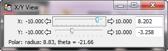
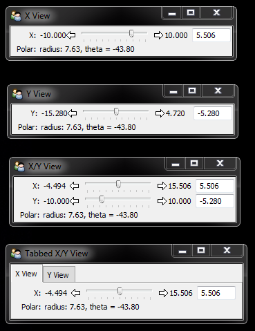
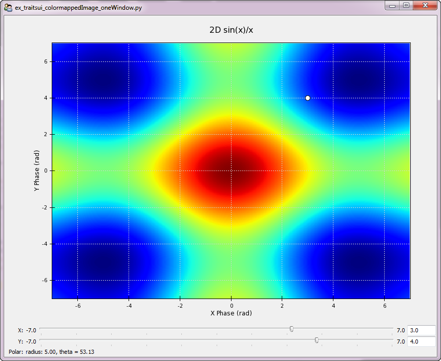
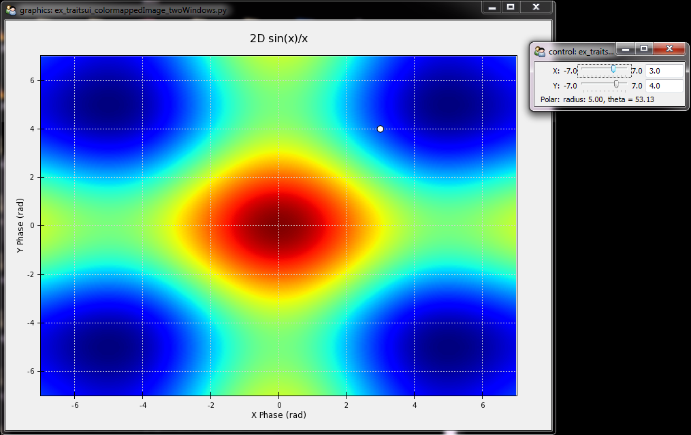

.. index:: Windows; Multiple

.. highlight:: python
  :linenothreshold: 5

How to Create Multiple Linked Windows in TraitsUI
=================================================

Based upon Peter Wang's Interactive Plotting with Chaco talk given
at the Scipy 2008 Advanced Tutorial Track, August 20, 2008

It's often useful to generate multiple windows with linked Traits. This
is especially true when displaying graphical data in a Chaco window, where the
graphical display is a large square window but the control panel must be a
differnt shape to accommodate grouping of various controls.

The figure below shows a single TraitsUI window that converts an XY point
into its polar equivalent and displays the result as a string.

   A single TraitsUI window

The code to generate this window follows::

  # ex_traitsui_oneWindow.py - simple window demo

  # Based upon Peter Wang's Interactive Plotting with Chaco talk given
  # at the Scipy 2008 Advanced Tutorial Track, August 20, 2008

  # standard imports
  from math import atan2, sqrt, pi

  # Enthought library imports
  from traits.api import HasTraits, Str, Range, on_trait_change
  from traitsui.api import Item, View, Group

  class oneWindow( HasTraits ):
    '''one window with linked traits'''

    # x position. suffix TR => Traits Range
    xPosTR = Range(
          value = 0.0,
          low = -1000.0,
          high = 1000.0,
          label = "X",
          desc = "the x position"
    )

    # y position. suffix TR => Traits Range
    yPosTR = Range(
          value = 0.0,
          low = -1000.0,
          high = 1000.0,
          label = "Y",
          desc = "the y position",
    )

    # the X,Y position in polar coordinates.  suffix TS => Traits String
    polarXYTS = Str(
          value = 'Indeterminate',
          default_value = 'Indeterminate',
          label = "Polar",
          desc = "the x,y point in polar coordinates"
    )

    # calculate a new polar coordinate whenever x or y changes
    @on_trait_change( 'xPosTR, yPosTR' )
    def _calculate_polarXY(self, name, new):
      radius = sqrt( self.xPosTR * self.xPosTR + self.yPosTR * self.yPosTR )
      try:
        angle = (180.0/pi) * atan2( self.yPosTR, self.xPosTR )
        self.polarXYTS = 'radius: %.2f, theta = %.2f' % (radius,angle)
      except:
        self.polarXYTS = 'Indeterminate'

    # a window with both the x and y positions
    traits_view = View(
      Group(
        Item( 'xPosTR' ),
        Item( 'yPosTR' ),
        Item( 'polarXYTS',style = 'readonly' ),
      ),
      title = 'X/Y View',
    )

  if __name__ == "__main__":

    oneWindow = oneWindow()
    oneWindow.configure_traits()

We can also display the same data in multiple windows, with the Traits linked
together. As we push a slider in one window, data in the other windows updates.

   Linked Traits in multiple windows

The code to generate these windows is::

  # ex_traitsui_manyWindows.py - multiple windowed gui with linked traits
  #
  # Particularly useful when the user wants one window to be a graphical
  # display and the second window to contain the traitsUI controls
  #
  # Based upon Peter Wang's Interactive Plotting with Chaco talk given
  # at the Scipy 2008 Advanced Tutorial Track, August 20, 2008

  # standard imports
  from math import atan2, sqrt, pi

  # Enthought library imports
  from traits.api import HasTraits, Str, Range
  from traits.api import on_trait_change
  from traitsui.api import Item, View, Group

  class ManyWindows( HasTraits ):
    '''multiple windows with linked traits'''

    # x position. suffix TR => Traits Range
    xPosTR = Range(
          value = 0.0,
          low = -1000.0,
          high = 1000.0,
          label = "X",
          desc = "the x position"
    )

    # y position. suffix TR => Traits Range
    yPosTR = Range(
          value = 0.0,
          low = -1000.0,
          high = 1000.0,
          label = "Y",
          desc = "the y position",
    )

    # the X,Y position in polar coordinates.  suffix TS => Traits String
    polarXYTS = Str(
          value = 'Indeterminate',
          default_value = 'Indeterminate',
          label = "Polar",
          desc = "the x,y point in polar coordinates"
    )

    # calculate a new polar coordinate whenever x or y changes
    @on_trait_change( 'xPosTR, yPosTR' )
    def _calculate_polarXY(self, name, new):
      radius = sqrt( self.xPosTR * self.xPosTR + self.yPosTR * self.yPosTR )
      try:
        angle = (180.0/pi) * atan2( self.yPosTR, self.xPosTR )
        self.polarXYTS = 'radius: %.2f, theta = %.2f' % (radius,angle)
      except:
        self.polarXYTS = 'Indeterminate'

  if __name__ == "__main__":

    # create views for each window. Note that these views are not in the
    # ManyWindows class but in the main routine.

    # window containing only the x position and output string.
    # suffix TV => Traits View
    view1TV = View(
      Item( 'xPosTR' ),
      Item( 'polarXYTS',style = 'readonly' ),
      title = 'X View',
    )

    # window containing only the y position and output string
    view2TV = View(
      Item( 'yPosTR' ),
      Item( 'polarXYTS',style = 'readonly' ),
      title = 'Y View',
    )

    # a window with both the x and y positions
    view3TV = View(
      Group(
        Item( 'xPosTR' ),
        Item( 'yPosTR' ),
        Item( 'polarXYTS',style = 'readonly' ),
      ),
      title = 'X/Y View',
    )

    ## the x and y positions and polar equivalents in multiple windows
    view4TV = View(
      Group(
        Item( 'xPosTR' ),
        Item( 'polarXYTS',style = 'readonly' ),
        label = 'X View',
      ),
      Group(
        Item( 'yPosTR' ),
        Item( 'polarXYTS',style = 'readonly' ),
        label = 'Y View',
      ),
      title = 'Tabbed X/Y View'
    )

    manyWindows = ManyWindows()

    # Finally, call edit_traits() on the first object(s), but configure_traits()
    # the last object. The final configure_traits() will start the wxPython
    # main loop, which activates the service loops on all of the proceeding
    # edit_traits() calls. The result is many windows, with linked GUI items
    # and trias.
    manyWindows.edit_traits( view = view1TV )
    manyWindows.edit_traits( view = view2TV )
    manyWindows.edit_traits( view = view3TV )
    manyWindows.configure_traits( view = view4TV )

We generate multiple windows by calling ``edit_traits()`` on the first three
views. The ``edit_traits()`` method simply sets the stage to build the windows
without actually building them on the screen and activating the service routines
that manage the windows. The final call to ``configure_windows()`` sets the stage
for the final view and calls the GUI handling routines for all of the staged
windows.

Using multiple windows can really improve the GUI and the user experience. The
figure below shows a simple image plot with sliders. The program uses the X
and Y Traits of the sliders to place a marker on the plot and display the
value of the function at that point.

   A Chaco plot, with linked Traits, in a single window

The X and Y sliders, and the polar output text box, are at the bottom of
the screen but the layout is poor. The TraitsUI items are too wide. The code to
generate this GUI is::

  ## ex_traitsUI.colormappedImage_oneWindow.py

  # standard imports
  import os
  from math import atan2, sqrt

  # numpy imports
  from numpy import sin, cos, exp, linspace, meshgrid, pi

  # Enthought imports
  from enable.api import Component, ComponentEditor
  from traits.api import HasTraits, Instance, Range, Str, on_trait_change
  from traitsui.api import Item, Group, View
  from chaco.api import ArrayPlotData, jet, Plot

  # the window size and title. the title is the file name
  windowSize = (800,600)
  windowTitle = os.path.split(__file__)[1]

  class OneWindow( HasTraits ):
    '''an image/scatter plot with graphics and control traits in one window'''

    # range values for the X and Y position of the point
    # x position. suffix TR => Traits Range
    xPosTR = Range(
        value = 0.0,
        low = -7.0,
        high = 7.0,
        label = "X",
        desc = "the x position",
    )

    # y position. suffix TR => Traits Range
    yPosTR = Range(
        value = 0.0,
        low = -7.0,
        high = 7.0,
        label = "Y",
        desc = "the y position",
    )

    # the X,Y position in polar coordinates.  suffix TS => Traits String
    polarXYTS = Str(
        value = 'Indeterminate',
        default_value = 'Indeterminate',
        label = "Polar",
        desc = "the x,y point in polar coordinates",
    )

    # create an interesting scalar field for the image plot
    twoPi = 2.0 * pi
    xA = linspace(-twoPi, twoPi, 600)
    yA = linspace(-twoPi, twoPi, 600)
    ( xMG,yMG ) = meshgrid( xA,yA )
    z1MG = exp(-(xMG**2 + yMG**2)) / 100.0
    zxMG = sin( xMG ) / xMG
    zyMG = sin( yMG ) / yMG
    zMG = zxMG + zyMG

    # Create an ArrayPlotData object and give it this data
    pdAPD = ArrayPlotData()
    pdAPD.set_data( "Z", zMG )
    pdAPD.set_data( "X",[xPosTR.default_value] )
    pdAPD.set_data( "Y",[yPosTR.default_value] )

    # Create the plot
    plotP = Plot( pdAPD )

    # add the image plot to this plot object
    plotP.img_plot(
        "Z",
        xbounds = (-7,7),
        ybounds = (-7,7),
        colormap = jet,
    )

    # add a scatter plot to this plot object to plot the single (X,Y) point
    plotP.plot(
        ("X","Y"),
        type = 'scatter',
        marker = "circle",
        color = "white",
        marker_size = 5,
    )

    # add the title and padding around the plot
    plotP.title = "2D sin(x)/x"
    plotP.padding = 50

    # grids, fonts, etc
    plotP.x_grid.visible = True
    plotP.y_grid.visible = True
    plotP.x_axis.font = "modern 16"
    plotP.y_axis.font = "modern 16"
    plotP.x_axis.title = "X Phase (rad)"
    plotP.y_axis.title = "Y Phase (rad)"

    @on_trait_change( 'xPosTR, yPosTR' )
    def _calculate_polarXY(self, name, new):
      '''calculate a new polar coordinate whenever x or y changes.
          also, load the new (X,Y) position into the scatter plot'''

      radius = sqrt( self.xPosTR * self.xPosTR + self.yPosTR * self.yPosTR )
      try:
        angle = (180.0/pi) * atan2( self.yPosTR, self.xPosTR )
        self.polarXYTS = 'radius: %.2f, theta = %.2f' % (radius,angle)
      except:
        self.polarXYTS = 'Indeterminate'

      # manually change the scatter plot data
      oneWindow.pdAPD.set_data( "X",[self.xPosTR] )
      oneWindow.pdAPD.set_data( "Y",[self.yPosTR] )

    # set up the view for both the graphics and control
    traits_view = View(
        Group(
            Item(
                'plotP',
                editor = ComponentEditor(size = windowSize),
                show_label = False,
            ),
            Item( 'xPosTR' ),
            Item( 'yPosTR' ),
            Item( 'polarXYTS', style = 'readonly' ),
            orientation = "vertical"
        ),
        resizable = True,
        title = windowTitle
    )

  if __name__ == "__main__":

    # build the object
    oneWindow = OneWindow()

    # set the (X,Y) point to form a 3-4-5 triangle. radius should
    # calculate to 5 and the angle should be around 53 degrees
    oneWindow.xPosTR = 3
    oneWindow.yPosTR = 4

    # build and edit the window. uses the traits_view view as the object view
    oneWindow.configure_traits()

Using the techniques described above, we can seperate the Chaco plot and the
control functions into two windows.

   A Chaco plot, with linked Traits, in two windows

The layout and screen usage is a lot better. The graphics completely fill up
one window and the controls are appropriately sized in the second window. The
code generating the last figure is::

  ## ex_traitsUI.colormappedImage_twoWindows.py

  # standard imports
  import os
  from math import atan2, sqrt

  # numpy imports
  from numpy import sin, cos, exp, linspace, meshgrid, pi

  # Enthought imports
  from enable.api import Component, ComponentEditor
  from traits.api import HasTraits, Instance, Range, Str, on_trait_change
  from traitsui.api import Item, Group, View
  from chaco.api import ArrayPlotData, jet, Plot

  # the window size and title. the title is the file name
  windowSize = (800,600)
  windowTitle = os.path.split(__file__)[1]

  class TwoWindows( HasTraits ):
    '''an image/scatter plot with graphics and control traits in seperate
    windows'''

    # range values for the X and Y position of the point
    # x position. suffix TR => Traits Range
    xPosTR = Range(
        value = 0.0,
        low = -7.0,
        high = 7.0,
        label = "X",
        desc = "the x position"
    )

    # y position. suffix TR => Traits Range
    yPosTR = Range(
        value = 0.0,
        low = -7.0,
        high = 7.0,
        label = "Y",
        desc = "the y position",
    )

    # the X,Y position in polar coordinates.  suffix TS => Traits String
    polarXYTS = Str(
        value = 'Indeterminate',
        default_value = 'Indeterminate',
        label = "Polar",
        desc = "the x,y point in polar coordinates"
    )

    # create an interesting scalar field for the image plot
    twoPi = 2.0 * pi
    xA = linspace(-twoPi, twoPi, 600)
    yA = linspace(-twoPi, twoPi, 600)
    ( xMG,yMG ) = meshgrid( xA,yA )
    z1MG = exp(-(xMG**2 + yMG**2)) / 100.0
    zxMG = sin( xMG ) / xMG
    zyMG = sin( yMG ) / yMG
    zMG = zxMG + zyMG

    # Create an ArrayPlotData object and give it this data
    pdAPD = ArrayPlotData()
    pdAPD.set_data( "Z", zMG )
    pdAPD.set_data( "X",[xPosTR.default_value] )
    pdAPD.set_data( "Y",[yPosTR.default_value] )

    # Create the plot
    plotP = Plot( pdAPD )

    # add the image plot to this plot object
    plotP.img_plot(
        "Z",
        xbounds = (-7,7),
        ybounds = (-7,7),
        colormap = jet,
    )

    # add a scatter plot to this plot object to plot the single (X,Y) point
    plotP.plot(
        ("X","Y"),
        type = 'scatter',
        marker = "circle",
        color = "white",
        marker_size = 5,
    )

    # add the title and padding around the plot
    plotP.title = "2D sin(x)/x"
    plotP.padding = 50

    # grids, fonts, etc
    plotP.x_grid.visible = True
    plotP.y_grid.visible = True
    plotP.x_axis.font = "modern 16"
    plotP.y_axis.font = "modern 16"
    plotP.x_axis.title = "X Phase (rad)"
    plotP.y_axis.title = "Y Phase (rad)"

    @on_trait_change( 'xPosTR, yPosTR' )
    def _calculate_polarXY(self, name, new):
      '''calculate a new polar coordinate whenever x or y changes.
          also, load the new (X,Y) position into the scatter plot'''

      radius = sqrt( self.xPosTR * self.xPosTR + self.yPosTR * self.yPosTR )
      try:
        angle = (180.0/pi) * atan2( self.yPosTR, self.xPosTR )
        self.polarXYTS = 'radius: %.2f, theta = %.2f' % (radius,angle)
      except:
        self.polarXYTS = 'Indeterminate'

      # manually change the scatter plot data
      twoWindows.pdAPD.set_data( "X",[self.xPosTR] )
      twoWindows.pdAPD.set_data( "Y",[self.yPosTR] )

  if __name__ == "__main__":

    # set up the view for the graphics window
    graphicsView = View(
        Item(
            'plotP',
            editor = ComponentEditor(size = windowSize),
            show_label = False,
        ),
        resizable = True,
        title = 'graphics: ' + windowTitle,
    )

    # set up the view for the control window
    controlView = View(
        Group(
            Item( 'xPosTR' ),
            Item( 'yPosTR' ),
            Item( 'polarXYTS', style = 'readonly' ),
            orientation = "vertical",
        ),
        resizable = True,
        title = 'control: ' + windowTitle,
    )

    # build the object
    twoWindows = TwoWindows()

    # set the (X,Y) point to form a 3-4-5 triangle. radius should
    # calculate to 5 and the angle should be around 53 degrees
    twoWindows.xPosTR = 3
    twoWindows.yPosTR = 4

    # build the two windows
    twoWindows.edit_traits( view = graphicsView )
    twoWindows.configure_traits( view = controlView )

Indices and tables
==================

* :ref:`genindex`
* :ref:`modindex`
* :ref:`search`
