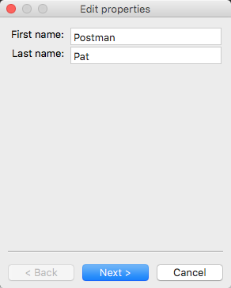
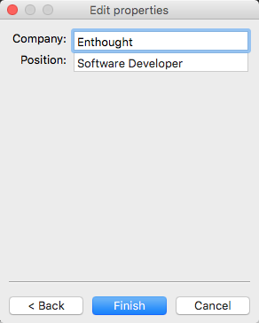

.. index:: View; customizing

.. _customizing-a-view:

==================
Customizing a View
==================

As shown in the preceding two chapters, it is possible to specify a window in
TraitsUI simply by creating a View object with the appropriate contents. In
designing real-life applications, however, you usually need to be able to
control the appearance and behavior of the windows themselves, not merely their
content. This chapter covers a variety of options for tailoring the appearance
of a window that is created using a View, including the type of window that a
View appears in, the :term:`command button`\ s that appear in the window, and
the physical properties of the window.

.. index:: kind attribute

.. _specifying-window-type-the-kind-attribute:

Specifying Window Type: the **kind** Attribute
----------------------------------------------

Many types of windows can be used to display the same data content. A form can
appear in a window, a wizard, or an embedded panel; windows can be *modal*
(i.e., stop all other program processing until the box is dismissed) or not, and
can interact with live data or with a buffered copy. In TraitsUI, a single View
can be used to implement any of these options simply by modifying its **kind**
attribute. There are seven possible values of **kind**:

.. index:: modal; window kind, live; window  kind, livemodal window kind
.. index:: nonmodal window kind, wizard; window kind, panel; window kind
.. index:: subpanel; window kind

*  'modal'
*  'live'
*  'livemodal'
*  'nonmodal'
*  'wizard'
*  'panel'
*  'subpanel'

These alternatives are described below. If the **kind** attribute of a View
object is not specified, the default value is 'modal'.

.. index:: windows; stand-alone, modal; definition, live; definition

.. _stand-alone-windows:

Stand-alone Windows
```````````````````

The behavior of a stand-alone TraitsUI window can vary over two significant
degrees of freedom. First, it can be :term:`modal`, meaning that when the window
appears, all other GUI interaction is suspended until the window is closed; if
it is not modal, then both the window and the rest of the GUI remain active and
responsive. Second, it can be :term:`live`, meaning that any changes that the
user makes to data in the window is applied directly and immediately to the
underlying model object or objects; otherwise the changes are made to a copy of
the model data, and are only copied to the model when the user commits them
(usually by clicking an :guilabel:`OK` or :guilabel:`Apply` button; see
:ref:`command-buttons-the-buttons-attribute`). The four possible combinations of
these behaviors correspond to four of the possible values of the 'kind '
attribute of the View object, as shown in the following table.

.. _matrix-of-traits-ui-windows-table:

.. rubric:: Matrix of TraitsUI windows

+-------------+----------------+-----------------+
|             |not modal       |modal            |
+=============+================+=================+
|**not live** |:term:`nonmodal`|:term:`modal`    |
+-------------+----------------+-----------------+
|**live**     |:term:`live`    |:term:`livemodal`|
+-------------+----------------+-----------------+

All of these window types are identical in appearance. Also, all types support
the **buttons** attribute, which is described in
:ref:`command-buttons-the-buttons-attribute`. Usually, a window with command
buttons is called a :term:`dialog box`.

.. TODO: Add diagrams and/or examples to clarify.

.. index:: wizard, windows; wizard

.. _wizards:

Wizards
```````
.. note:: Wizard views are only supported with the WX backend!

Unlike a standalone window, whose contents appear as a single page or a tabbed
display, a :term:`wizard` window presents the view's Groups as a series of
pages that a user must navigate sequentially.
(For more information about breaking up a view into groups, see
:ref:`the-group-object`.)

.. _example-3.1-displaying-a-view-the-wizard-style:

.. rubric:: Example 3.1: Displaying a view the "wizard" style

::

  # wizard.py ---Example of a traits-based wizard UI

  from traits.api import HasTraits, Str
  from traitsui.api import Item, View, VGroup

  class Person(HasTraits):
      first_name = Str
      last_name = Str

      company = Str
      position = Str

      view = View(
          VGroup(
              Item("first_name"),
              Item("last_name")
          ),
          VGroup(
              Item("company"),
              Item("position")
          )
      )

  person = Person(first_name='Postman', last_name='Pat', company="Enthought",
                  position="Software Developer")
  person.configure_traits(kind='wizard')


leads to the following 2 modal dialogs:






TraitsUI Wizards are always modal and live. They always display a standard
wizard button set; i.e., they ignore the **buttons** View attribute. In short,
wizards are considerably less flexible than windows, and are primarily suitable
for highly controlled user interactions such as software installation.

.. index:: panel, subpanel, windows; panel, windows; subpanel

.. _panels-and-subpanels:

Panels and Subpanels
````````````````````

Both dialog boxes and wizards are secondary windows that appear separately from
the main program display, if any. Often, however, you might need to create a
window element that is embedded in a larger display. For such cases, the
**kind** of the corresponding View object should be 'panel' or 'subpanel '.

A :term:`panel` is very similar to a window, except that it is embedded in a
larger window, which need not be a TraitsUI window. Like windows, panels
support the **buttons** View attribute, as well as any menus and toolbars that
are specified for the View (see :ref:`menus-and-menu-bars`). Panels are always
live and nonmodal.

A :term:`subpanel` is almost identical to a panel. The only difference is that
subpanels do not display :term:`command button`\ s even if the View specifies
them.

.. Do subpanels support menus and toolbars? If not, add this to the
   documentation. (If so, why do they?)

.. index:: buttons; attribute

.. _command-buttons-the-buttons-attribute:

Command Buttons: the **buttons** Attribute
------------------------------------------

A common feature of many windows is a row of command buttons along the bottom of
the frame. These buttons have a fixed position outside any scrolled panels in
the window, and are thus always visible while the window is displayed. They are
usually used for window-level commands such as committing or cancelling the
changes made to the form data, or displaying a help window.

In TraitsUI, these command buttons are specified by means of the View object's
**buttons** attribute, whose value is a list of buttons to display. [6]_
Consider the following variation on Example 3:

.. index::
   pair: examples; buttons

.. _example-4-using-a-view-object-with-buttons:

.. rubric:: Example 4: Using a View object with buttons

::

    # configure_traits_view_buttons.py -- Sample code to demonstrate
    #                                     configure_traits()

    from traits.api import HasTraits, Str, Int
    from traitsui.api import View, Item
    from traitsui.menu import OKButton, CancelButton

    class SimpleEmployee(HasTraits):
        first_name = Str
        last_name = Str
        department = Str

        employee_number = Str
        salary = Int

    view1 = View(Item(name = 'first_name'),
                 Item(name = 'last_name'),
                 Item(name = 'department'),
                 buttons = [OKButton, CancelButton])

    sam = SimpleEmployee()
    sam.configure_traits(view=view1)

The resulting window has the same content as before, but now two buttons are
displayed at the bottom: :guilabel:`OK` and :guilabel:`Cancel`:

.. figure:: images/ui_for_ex4.jpg
   :alt: Dialog box with three fields and OK and Cancel buttons.

   Figure 4: User interface for Example 4

There are six standard buttons defined by TraitsUI. Each of the standard
buttons has matching a string alias. You can either import and use the button
names, or simply use their aliases:

.. index:: buttons; standard, UndoButton, ApplyButton, RevertButton, OKButton
.. index:: CancelButton

.. _command-button-aliases-table:

.. rubric:: Command button aliases

+--------------+---------------------------+
|Button Name   |Button Alias               |
+==============+===========================+
|UndoButton    |'Undo'                     |
+--------------+---------------------------+
|ApplyButton   |'Apply'                    |
+--------------+---------------------------+
|RevertButton  |'Revert'                   |
+--------------+---------------------------+
|OKButton      |'OK'  (case sensitive!)    |
+--------------+---------------------------+
|CancelButton  |'Cancel'                   |
+--------------+---------------------------+

Alternatively, there are several pre-defined button lists that can be imported
from traitsui.menu and assigned to the buttons attribute:

.. index:: OKCancelsButtons, ModalButtons, LiveButtons

* OKCancelButtons = ``[OKButton, CancelButton ]``
* ModalButtons = ``[ ApplyButton, RevertButton, OKButton, CancelButton, HelpButton ]``
* LiveButtons = ``[ UndoButton, RevertButton, OKButton, CancelButton, HelpButton ]``

Thus, one could rewrite the lines in Example 4 as follows, and the
effect would be exactly the same::

    from traitsui.menu import OKCancelButtons

                 buttons = OKCancelButtons

.. index:: NoButtons

The special constant NoButtons can be used to create a window or panel
without command buttons. While this is the default behavior, NoButtons can
be useful for overriding an explicit value for **buttons**. You can also specify
``buttons = []`` to achieve the same effect. Setting the **buttons** attribute
to an empty list has the same effect as not defining it at all.

It is also possible to define custom buttons and add them to the **buttons**
list; see :ref:`custom-command-buttons` for details.

.. index:: View; attributes, attributes; View

.. _other-view-attributes:

Other View Attributes
---------------------

.. index:: dock attribute; View, height attribute; View, icon attribute
.. index:: image attribute; View, resizable attribute; View
.. index:: scrollable attribute, statusbar attribute, style attribute; View
.. index:: title attribute, width attribute; View, x attribute, y attribute

.. _attributes-of-view-by-category-table:

.. rubric:: Attributes of View, by category


Window display
   These attributes control the visual properties of the window itself,
   regardless of its content.

   dock: {'fixed', 'horizontal', 'vertical', 'tabbed'}
      The default docking style to use for sub-groups of the view. The following
      values are possible:

      * 'fixed': No rearrangement of sub-groups is allowed.
      * 'horizontal': Moveable elements have a visual "handle" to the left by
        which the element can be dragged.
      * 'vertical': Moveable elements have a visual "handle" above them by
        which the element can be dragged.
      * 'tabbed': Moveable elements appear as tabbed pages, which can be
        arranged within the window or "stacked" so that only one appears at
        at a time.
   height: int or float
      Requested height for the view window, as an (integer) number of pixels, or
      as a (floating point) fraction of the screen height.
   icon: str
      The name of the icon to display in the dialog window title bar.
   image: Image
      The image to display on notebook tabs.
   resizable: bool
      Can the user resize the window?
   scrollable: bool
      Can the user scroll the view? If set to True, window-level scroll bars
      appear whenever the window is too small to show all of its contents at
      one time. If set to False, the window does not scroll, but individual
      widgets might still contain scroll bars.
   statusbar:
      Status bar items to add to the view's status bar. The value can be:

      - **None**: No status bar for the view (the default).
      - string: Same as ``[StatusItem(name=string)]``.
      - StatusItem: Same as ``[StatusItem]``.
      - ``[[StatusItem|string], ... ]``: Create a status bar with one field for
        each StatusItem in the list (or tuple). The status bar fields are
        defined from left to right in the order specified. A string value is
        converted to: ``StatusItem(name=string)``:
   style:
      The default editor style of elements in the view.
   title: str
      Title for the view, displayed in the title bar when the view appears as
      a secondary window (i.e., dialog or wizard). If not specified, "Edit
      properties" is used as the title.
   width: int or float
      Requested width for the view window, as an (integer) number of pixels,
      or as a (floating point) fraction of the screen width.
   x, y: int or float
      The requested x and y coordinates for the window (positive for top/left,
      negative for bottom/right, either pixels or proportions)

   .. index:: close_result attribute
   .. index:: handler attribute
   .. index:: key_bindings attribute
   .. index:: menubar attribute
   .. index:: model_view attribute
   .. index:: on_apply attribute
   .. index:: toolbar attribute
   .. index:: updated attribute
   .. index:: content attribute; View
   .. index:: drop_class attribute

Command
   TraitsUI menus and toolbars are generally implemented in conjunction with
   custom :term:`Handler`\ s; see :ref:`menus-and-menu-bars` for details.

   buttons:
      List of button actions to add to the view. The **traitsui.menu**
      module defines standard buttons, such as **OKButton**, and standard sets
      of buttons, such as **ModalButtons**, which can be used to define a value
      for this attribute. This value can also be a list of button name strings,
      such as ``['OK', 'Cancel', 'Help']``. If set to the empty list, the
      view contains a default set of buttons (equivalent to **LiveButtons**:
      Undo/Redo, Revert, OK, Cancel, Help). To suppress buttons in the view,
      use the **NoButtons** variable, defined in **traitsui.menu**.
   close_result:
      What result should be returned if the user clicks the window or dialog
      close button or icon?
   handler:
      The Handler object that provides GUI logic for handling events in the
      window. Set this attribute only if you are using a custom Handler. If
      not set, the default Traits UI Handler is used.
   key_bindings:
      The set of global key bindings for the view. Each time a key is pressed
      while the view has keyboard focus, the key is checked to see if it is one
      of the keys recognized by the KeyBindings object.
   menubar:
      The menu bar for the view. Usually requires a custom **handler**.
   model_view:
      The factory function for converting a model into a model/view object.
   on_apply:
      Called when modal changes are applied or reverted.
   toolbar:
      The toolbar for the view. Usually requires a custom **handler**.
   updated: Event
      Event when the view has been updated.

   .. index:: export attribute; View
   .. index:: imports attribute
   .. index:: object attribute; View

Content
   The **imports** and **drop_class** attributes control what objects can be
   dragged and dropped on the view.

   content:
      The top-level Group object for the view.
   drop_class:
      Class of dropped objects that can be added.
   export:
      The category of exported elements.
   imports:
      The valid categories of imported elements.
   object:
      The default object being edited.

   .. index:: help attribute; View
   .. index:: help_id attribute; View

User help
   help: (deprecated)
      The **help** attribute is a deprecated way to specify that the
      View has a Help button. Use the buttons attribute instead (see
      :ref:`command-buttons-the-buttons-attribute` for details).
   help_id:
      The **help_id** attribute is not used by Traits, but can be used by a
      custom help handler.

   .. index:: id attribute; View

Unique
   id:
      The **id** attribute is used as a key to save user preferences about a
      view, such as customized size and position, so that they are restored
      the next time the view is opened. The value of **id** must be unique
      across all Traits-based applications on a system. If no value is
      specified, no user preferences are saved for the view.

.. rubric:: Footnotes

.. [6] Actually, the value of the **buttons** attribute is really a list of
   Action objects, from which GUI buttons are generated by TraitsUI. The
   Action class is described in :ref:`actions`.
