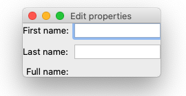
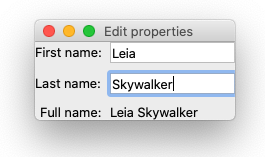

.. _testing-tutorial-first-test:

First simple test
=================

Suppose we have a TraitsUI GUI application like this::

    from traits.api import HasTraits, observe, Str
    from traitsui.api import TextEditor, Item, View

    class Form(HasTraits):

        first_name = Str()
        last_name = Str()
        full_name = Str()

        @observe("first_name")
        @observe("last_name")
        def _full_name_updated(self, event):
            self.full_name = " ".join([self.first_name, self.last_name])

        view = View(
            Item(name="first_name"),
            Item(name="last_name"),
            Item(name="full_name", style="readonly"),
        )

    if __name__ == "__main__":
        form = Form()
        form.configure_traits()    # GUI appears

As a user types in the first two text boxes, the last read only text field will
be updated. A test that demonstrates this behavior will need to do the
following things:

#. Open the GUI
#. Find the text boxes and the read only display field
#. Simulate the user typing in the text boxes
#. Inspect and assert the content in the read only field

Step 1: Creating a GUI
----------------------

Test code can open and close the GUI using |UITester.create_ui|::

    from traitsui.testing.api import UITester

    form = Form()
    tester = UITester()
    with tester.create_ui(form) as ui:
        pass

Running this test, you should see the GUI being opened and closed immediately.
We will use the ``ui`` (an instance of |UI|) in the next step.

Step 2: Locating a UI editor
----------------------------

We need to find the text boxes in order to modify them. |UITester.find_by_name|
can be used to find the editors in the UI by names. The names are simply the
names used in defining |Item| in the view::

    from traitsui.testing.api import UITester

    form = Form()
    tester = UITester()
    with tester.create_ui(form) as ui:
        first_name_field = tester.find_by_name(ui, "first_name")
        last_name_field = tester.find_by_name(ui, "last_name")
        full_name_field = tester.find_by_name(ui, "full_name")

The ``first_name_field``, ``last_name_field`` and ``full_name_field`` are
objects we can use to interact with in the test.

Step 3: Perform a user interaction to modify GUI state
------------------------------------------------------

We can find the interactions supported by ``first_name_field`` using
|UIWrapper.help| method::

        full_name_field.help()

will print something like this (abbreviated for the purpose of this section)::

    Interactions
    ------------
    <class 'traitsui.testing.tester.command.KeyClick'>
        An object representing the user clicking a key on the keyboard.
        ...

    <class 'traitsui.testing.tester.command.KeySequence'>
        An object representing the user typing a sequence of keys.
        ...

    <class 'traitsui.testing.tester.command.MouseClick'>
        An object representing the user clicking a mouse button.
        ...

    <class 'traitsui.testing.tester.query.DisplayedText'>
        An object representing an interaction to obtain the displayed
        (echoed) plain text.
        ...

    Locations
    ---------
    No locations are supported.

Objects in the "Interactions" section can be used with |UIWrapper.perform|
and |UIWrapper.inspect|. To simulate the text boxes being edited, we want to
|UIWrapper.perform| an action that represents the user typing a sequence of
keys. |KeySequence| is exactly what we need::

    from traitsui.testing.api import KeySequence

    # ...
        first_name_field.perform(KeySequence("Leia"))
        last_name_field.perform(KeySequence("Skywalker"))

Adding this to the existing test, this is what we have::

    from traitsui.testing.api import KeySequence, UITester

    form = Form()
    tester = UITester()
    with tester.create_ui(form) as ui:
        first_name_field = tester.find_by_name(ui, "first_name")
        first_name_field.perform(KeySequence("Leia"))

        last_name_field = tester.find_by_name(ui, "last_name")
        last_name_field.perform(KeySequence("Skywalker"))

We can confirm this behavior visually by setting the |UITester.delay| parameter
and run the test again::

    tester = UITester(delay=50)    # delay in milliseconds

Step 4: Inspect the GUI states as the user sees it
--------------------------------------------------

To extract the displayed text in the read only field, we can use
|UIWrapper.inspect| with the |DisplayedText| object::

    from traitsui.testing.api import DisplayedText
    # ...
        displayed = full_name_field.inspect(DisplayedText())
        assert displayed == "Leia Skywalker"

Our final test
--------------

.. code-block::

    from traitsui.testing.api import DisplayedText, KeySequence, UITester

    form = Form()
    tester = UITester()
    with tester.create_ui(form) as ui:
        first_name_field = tester.find_by_name(ui, "first_name")
        first_name_field.perform(KeySequence("Leia"))

        last_name_field = tester.find_by_name(ui, "last_name")
        last_name_field.perform(KeySequence("Skywalker"))

        full_name_field = tester.find_by_name(ui, "full_name")
        displayed = full_name_field.inspect(DisplayedText())
        assert displayed == "Leia Skywalker"

If the application is written correctly, the test should pass.

See the test capturing a bug
----------------------------

If we forgot to add the :func:`~traits.has_traits.observe` decorators::

    class Form(HasTraits):

        first_name = Str()
        last_name = Str()
        full_name = Str()

        # Let's suppose we left these out:
        # @observe("first_name")
        # @observe("last_name")
        def _full_name_updated(self, event):
            self.full_name = " ".join([self.first_name, self.last_name])

        view = View(
            Item(name="first_name"),
            Item(name="last_name"),
            Item(name="full_name", style="readonly"),
        )

The ``full_name`` field won't be updated in the GUI, which would be a bug.
If we run the test again, we will get an assertion error:

.. code-block:: bash

    Traceback (most recent call last):
    File "first-test.py", line 35, in <module>
        assert displayed == "Leia Skywalker"
    AssertionError

(If the test was written with a testing framework, more failure information on
the actual value will be available.)

What did we learn?
------------------

- |UITester.create_ui| makes it easy to create and dispose a |UI|. Such a
  minimal test makes sure the view can be initialized without errors.
- |UITester.find_by_name| can be used to find the TraitsUI editor inside a UI
  for further interactions.
- |UIWrapper.perform| can be used to mutate GUI states.
- |UIWrapper.inspect| can be used to inspect GUI states.
- From the output of |UIWrapper.help|, objects listed in the "Interactions"
  section can be used with |UIWrapper.perform| and |UIWrapper.inspect|.
- The |UITester.delay| parameter can be set to a nonzero value to help with
  visual confirmation.

.. include:: ../substitutions.rst
