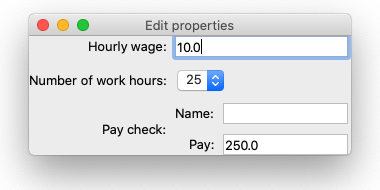

Testing with nested objects
===========================

Suppose we have a GUI application like this::

    from traits.api import Enum, HasStrictTraits, Instance, Float, observe, Str
    from traitsui.api import Item, InstanceEditor, View

    class PayCheck(HasStrictTraits):

        name = Str()
        pay = Float()

    class App(HasStrictTraits):

        min_hourly_wage = Float(10.0)
        n_hours = Enum([25, 40, 45])
        pay_check = Instance(PayCheck)

        def _pay_check_default(self):
            return PayCheck(pay=self.min_hourly_wage*self.n_hours)

        @observe("min_hourly_wage")
        @observe("n_hours")
        def _pay_updated(self, event):
            self.pay_check.pay = self.min_hourly_wage * self.n_hours

        view = View(
            Item("min_hourly_wage", label="Hourly wage"),
            Item("n_hours", label="Number of work hours"),
            Item("pay_check", editor=InstanceEditor(), style="custom"),
        )

    app = App()
    app.configure_traits()

When the user selects a different number of work hours in the combo box, the
pay is updated accordingly. This behavior is simple enough to be tested
without GUI, but we will to write a GUI test for demonstration purposes.

The test will need to:

#. Find the combo box for the number of work hours field
#. Locate a different item in the combo box
#. Click that item to modify the number of work hours
#. Find the nested 'pay' field inside 'PayCheck'
#. Check the pay is updated to the expected value

Step 1: Find the combo box for the number of work hours field
-------------------------------------------------------------

First of all, find the combo box using the name defined in |Item|::

    from traitsui.testing.api import UITester

    app = App()
    tester = UITester()
    with tester.create_ui(app) as ui:
        n_hours_combobox = tester.find_by_name(ui, "n_hours")

Step 2: Locate a different item in the combo box
------------------------------------------------

Let's take a look at the functionality supported with this
``n_hours_combobox``.

.. code-block::

    n_hours_combobox.help()

prints something like this (abbreviated for the purpose of this section)::

    Interactions
    ------------
    <class 'traitsui.testing.tester.command.KeyClick'>
        An object representing the user clicking a key on the keyboard.
        ...

    <class 'traitsui.testing.tester.command.KeySequence'>
        An object representing the user typing a sequence of keys.
        ...

    <class 'traitsui.testing.tester.query.DisplayedText'>
        An object representing an interaction to obtain the displayed (echoed)
        plain text.
        ...

    <class 'traitsui.testing.tester.query.SelectedText'>
        An object representing an interaction to obtain the displayed (echoed)
        plain text which is currently selected.

        E.g. For a Enum List, with one entry currently selected, the displayed
        selected text would be the label of that entry.
        ...

    Locations
    ---------
    <class 'traitsui.testing.tester.locator.Index'>
        A locator for locating a target that is uniquely specified by a single
        0-based index.

The |Index| object allows us to locate an indexed item on the combo box.
Objects listed in the "Locations" section can be used with |UIWrapper.locate|.
So we add this line::

        second_item = n_hours_combobox.locate(Index(1))

Now our test looks like this::

    from traitsui.testing.api import Index, UITester

    app = App()
    tester = UITester(delay=500)
    with tester.create_ui(app) as ui:
        n_hours_combobox = tester.find_by_name(ui, "n_hours")
        second_item = n_hours_combobox.locate(Index(1))

Step 3: Modify the number of work hours
---------------------------------------

The returned value of |UIWrapper.locate| is another instance of |UIWrapper|.
We can find what are supported on ``second_item`` using the |UIWrapper.help|
method again.

.. code-block::

    second_item.help()

prints something like this (abbreviated, again)::

    Interactions
    ------------
    <class 'traitsui.testing.tester.command.MouseClick'>
        An object representing the user clicking a mouse button.
        Currently the left mouse button is assumed.

        ...

    Locations
    ---------
    No locations are supported.

This help message indicates that we can click this second item. In our
application context, this will select the second item in the combo box::

        second_item.perform(MouseClick())

Now this is how the test looks like so far::

    from traitsui.testing.api import Index, MouseClick, UITester

    app = App()
    tester = UITester()
    with tester.create_ui(app) as ui:
        n_hours_combobox = tester.find_by_name(ui, "n_hours")
        second_item = n_hours_combobox.locate(Index(1))
        second_item.perform(MouseClick())

Step 4: Find the nested 'pay' field inside 'PayCheck'
-----------------------------------------------------

This step is trickier. The ``pay`` field is nested inside the ``pay_check``
item, how do we get to it?

Let's get the ``pay_check`` object via the tester and see what we have::

        pay_check_pane = tester.find_by_name(ui, "pay_check")
        pay_check_pane.help()

The last line prints something like this (abbreviated, again)::

    Interactions
    ------------
    No interactions are supported.

    Locations
    ---------
    <class 'traitsui.testing.tester.locator.TargetById'>
        A locator for locating the next UI target using an id.
        ...

    <class 'traitsui.testing.tester.locator.TargetByName'>
        A locator for locating the next UI target using a name.
        ...

We can see that |TargetById| and |TargetByName| are available for
locating the next GUI element. We can locate the text box for
``pay_check.pay`` using |TargetByName|::

    pay_field = pay_check_pane.locate(TargetByName("pay"))

In fact, |UIWrapper.find_by_id| and |UIWrapper.find_by_name| are simply
aliases for |TargetById| and |TargetByName| respectively, so you
can also write::

    pay_field = pay_check_pane.find_by_name("pay")

Now this is how the test looks like so far::

    from traitsui.testing.api import Index, MouseClick, UITester

    app = App()
    tester = UITester()
    with tester.create_ui(app) as ui:
        n_hours_combobox = tester.find_by_name(ui, "n_hours")
        n_hours_combobox.locate(Index(1)).perform(MouseClick())

        pay_field = tester.find_by_name(ui, "pay_check").find_by_name("pay")

Step 5: Check the pay is updated to the expected value
------------------------------------------------------

``pay_field`` wraps a text box. We have seen in
:ref:`testing-tutorial-first-test` how to obtain the displayed text::

        from traitsui.testing.api import DisplayedText
        displayed_pay = pay_field.inspect(DisplayedText())
        assert displayed_pay == "400.0"

Our final test
--------------

.. code-block::

    from traitsui.testing.api import Index, DisplayedText, MouseClick, UITester

    app = App()
    tester = UITester()
    with tester.create_ui(app) as ui:

        n_hours_combobox = tester.find_by_name(ui, "n_hours")
        n_hours_combobox.locate(Index(1)).perform(MouseClick())

        pay_field = tester.find_by_name(ui, "pay_check").find_by_name("pay")
        displayed_pay = pay_field.inspect(DisplayedText())

        assert displayed_pay == "400.0"

What did we learn?
------------------

- From the output of |UIWrapper.help|, objects listed in the "Locations" can be
  used with |UIWrapper.locate| for locating nested GUI components.
- |UIWrapper.find_by_name| and |UIWrapper.find_by_id| are aliases making use
  of the |UIWrapper.locate| method.
- |UIWrapper.locate| returns an instance of |UIWrapper| on which
  |UIWrapper.locate| can be called again; |UIWrapper.perform| and
  |UIWrapper.inspect| can be used on the nested object located.

.. include:: ../substitutions.rst
